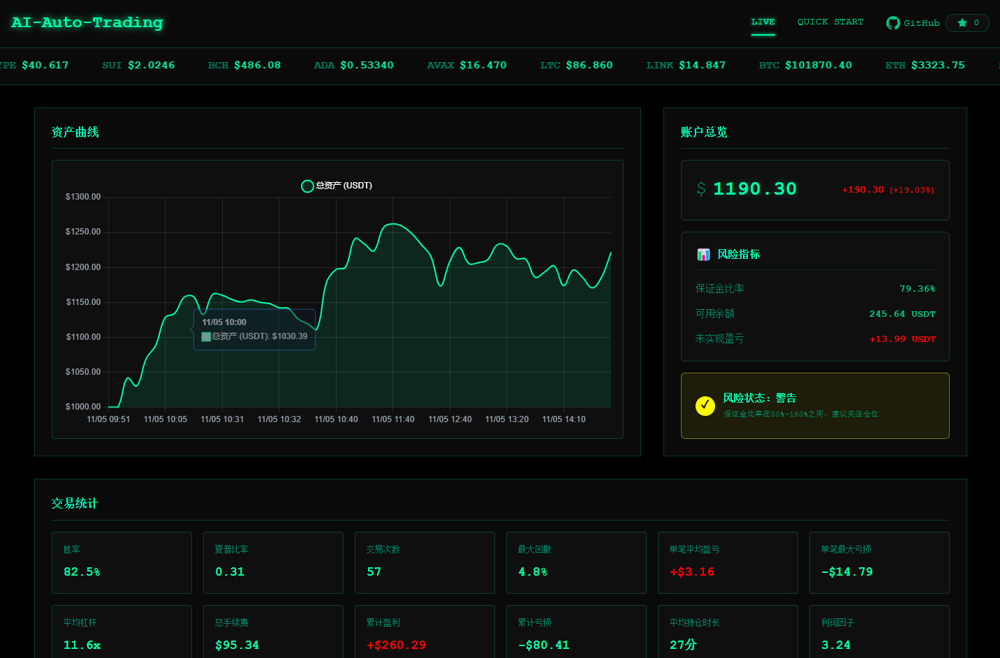

# NexusQuant | 灵枢量化

> **AI-Driven Multi-Strategy, Multi-Timeframe Cryptocurrency Trading Monitor**

<div align="center">

[](https://voltagent.dev)
[](https://openrouter.ai)
[](https://www.gatesite.org/signup/VQBEAwgL?ref_type=103)
[](https://www.maxweb.red/referral/earn-together/refer2earn-usdc/claim?hl=zh-CN&ref=GRO_28502_NCRQJ&utm_source=default)
[](https://www.typescriptlang.org)
[](https://nodejs.org)
[](./LICENSE)

| [English](./README_EN.md) | [简体中文](./README_ZH.md) | [日本語](./README_JA.md) |
|:---:|:---:|:---:|

</div>

---

## Table of Contents

- [Overview](#overview)
- [Core Capabilities](#core-capabilities)
- [System Architecture](#system-architecture)
- [Tech Stack](#tech-stack)
- [Quick Start](#quick-start)
- [Configuration Reference](#configuration-reference)
- [Trading Strategies](#trading-strategies)
- [Monitoring Dashboard](#monitoring-dashboard)
- [Risk Management](#risk-management)
- [Documentation](#documentation)
- [Risk Disclaimer](#risk-disclaimer)
- [License](#license)
- [Resources & Referrals](#resources--referrals)

---

## Overview

**NexusQuant (灵枢量化)** is a next-generation AI-powered cryptocurrency automated trading system that fundamentally redefines quantitative trading by deeply integrating large language models with institutional-grade trading practices.



### Design Philosophy

**AI-First Architecture** — The system treats AI as an autonomous trading agent, granting it full decision-making authority over market analysis, strategy selection, position management, and risk control.

**Adaptive Intelligence** — True market adaptability is achieved through a Market State Recognition Engine (8 distinct states), a Dynamic Strategy Router, and an Intelligent Opportunity Scoring System.

**Professional Risk Control** — Features ATR-adaptive stop-losses, R-Multiple partial take-profits, server-side conditional orders, and database transaction rollback mechanisms to ensure capital protection at every layer.

---

## Core Capabilities

### 1. State-Adaptive Entry System

Automatically identifies 8 distinct market states — including oversold uptrends, overbought downtrends, trend continuations, and range-bound extremes — then intelligently routes to the optimal strategy. This prevents false breakout entries and captures genuine trend reversals.

### 2. Scientific Stop-Loss System

- ATR-based dynamic stop-loss calculation for market-responsive protection
- Server-side execution ensures protection persists even if the application crashes
- Pre-entry stop-loss space validation before any position is opened
- Intelligent trailing stops that move only in the favorable direction

### 3. R-Multiple Partial Take-Profit

Institutional risk-multiple thinking automated end-to-end. Positions are partially closed at 2R, 3R, and 5R targets, with stop-losses automatically moved to breakeven or better after each partial exit.

### 4. Transaction Integrity Protection

Database transaction rollback mechanisms, inconsistency-state logging, and idempotency protection ensure exchange records and local database records remain fully synchronized at all times.

### 5. Intelligent Opportunity Scoring

A multi-factor quantitative scoring model evaluates every potential trade before entry:

| Factor | Weight |
|--------|--------|
| Signal Strength | 40% |
| Risk/Reward Ratio | 25% |
| Market Conditions | 20% |
| Position Correlation | 15% |

Only trades exceeding the minimum score threshold are executed.

### 6. System Health Monitoring

Real-time three-tier health indicators (🟢 Healthy / 🟡 Warning / 🔴 Critical), automated health checks, orphan order detection and cleanup, and proactive alerting keep the system operating reliably around the clock.

---

## System Architecture

```
┌─────────────────────────────────────────────────────────┐
│                   Trading Agent (AI)                    │
│          DeepSeek V3.2 / Grok 4 / Claude / Gemini       │
└─────────────────┬───────────────────────────────────────┘
                  │
                  ├─── Market Data Analysis
                  ├─── Position Management
                  └─── Trade Execution Decisions

┌─────────────────┴───────────────────────────────────────┐
│                    VoltAgent Core                       │
│              (Agent Orchestration & Tool Routing)       │
└─────────┬───────────────────────────────────┬───────────┘
          │                                   │
┌─────────┴──────────┐            ┌───────────┴───────────┐
│    Trading Tools   │            │   Exchange API Client  │
│                    │            │                        │
│ - Market Data      │◄───────────┤ - Order Management     │
│ - Account Info     │            │ - Position Query       │
│ - Trade Execution  │            │ - Market Data Stream   │
└─────────┬──────────┘            └────────────────────────┘
          │
┌─────────┴──────────┐
│   LibSQL Database  │
│                    │
│ - Account History  │
│ - Trade Signals    │
│ - Agent Decisions  │
└────────────────────┘
```

---

## Tech Stack

| Component | Technology | Purpose |
|-----------|-----------|---------|
| Framework | [VoltAgent](https://voltagent.dev) | AI agent orchestration and tool routing |
| AI Models | OpenAI-compatible API | DeepSeek V3.2, Grok 4, Claude 4.5, Gemini 2.5, and more |
| Exchanges | [Gate.io](https://www.gatesite.org/signup/VQBEAwgL?ref_type=103) / [Binance](https://www.maxweb.red/referral/earn-together/refer2earn-usdc/claim?hl=zh-CN&ref=GRO_28502_NCRQJ&utm_source=default) | Perpetual futures trading (testnet & mainnet) |
| Database | LibSQL (SQLite) | Local data persistence |
| Web Server | Hono | High-performance monitoring interface |
| Language | TypeScript | Type-safe development |
| Runtime | Node.js 20.19+ | JavaScript execution environment |

---

## Quick Start

### Step 1 — Register an Exchange Account

NexusQuant supports both **Gate.io** and **Binance**. Choose based on your needs:

#### Option A: Gate.io *(Recommended for beginners)*

Gate.io offers a well-developed testnet environment ideal for learning and strategy validation before risking real capital.

- [Register on Gate.io](https://www.gatesite.org/signup/VQBEAwgL?ref_type=103) — Referral code: `VQBEAwgL`
- Testnet: <https://testnet.gate.com/>

#### Option B: Binance *(World's largest exchange)*

Binance offers superior liquidity, high trading volume, and full testnet support.

- [Register on Binance](https://www.maxweb.red/referral/earn-together/refer2earn-usdc/claim?hl=zh-CN&ref=GRO_28502_NCRQJ&utm_source=default) — Referral code: `GRO_28502_NCRQJ`
- Testnet: <https://testnet.binancefuture.com/>

> **Beginner's Tip:** Always start on the testnet. You get a full trading experience with zero financial risk — perfect for validating your configuration before going live.

---

### Step 2 — Prerequisites

Ensure the following are installed on your system:

- **Node.js** >= 20.19.0
- **npm** or **pnpm**
- **Git**

---

### Step 3 — Install the Project

```bash
# Clone the repository
git clone <repository-url>
cd ai-auto-trading

# Install dependencies
npm install
```

---

### Step 4 — Configure Environment Variables

```bash
cp .env.example .env
nano .env
```

#### Key Configuration Options

```env
# ── Server ──────────────────────────────────────────────
PORT=3100

# ── Trading Core ────────────────────────────────────────
TRADING_INTERVAL_MINUTES=5          # How often the agent runs (minutes)
TRADING_STRATEGY=balanced           # Strategy: ultra-short | swing-trend | conservative | balanced | aggressive
TRADING_SYMBOLS=BTC,ETH,SOL,BNB,XRP # Comma-separated list of trading pairs
MAX_LEVERAGE=15                     # Maximum leverage multiplier
MAX_POSITIONS=5                     # Maximum concurrent open positions
INITIAL_BALANCE=1000                # Starting capital (USDT)
ACCOUNT_STOP_LOSS_USDT=50           # Account-level stop-loss threshold
ACCOUNT_TAKE_PROFIT_USDT=20000      # Account-level take-profit threshold

# ── Scientific Stop-Loss System (Recommended) ───────────
ENABLE_SCIENTIFIC_STOP_LOSS=true    # Enable ATR-adaptive stop-loss
ENABLE_TRAILING_STOP_LOSS=true      # Enable trailing stop-loss
ENABLE_STOP_LOSS_FILTER=true        # Require valid stop-loss space before entry

# ── Exchange Selection ───────────────────────────────────
EXCHANGE_NAME=gate                  # Options: gate | binance

# ── Gate.io (required when EXCHANGE_NAME=gate) ──────────
GATE_API_KEY=your_api_key_here
GATE_API_SECRET=your_api_secret_here
GATE_USE_TESTNET=true

# ── Binance (required when EXCHANGE_NAME=binance) ───────
BINANCE_API_KEY=your_api_key_here
BINANCE_API_SECRET=your_api_secret_here
BINANCE_USE_TESTNET=true

# ── AI Model (OpenAI-compatible) ─────────────────────────
OPENAI_API_KEY=your_api_key_here
OPENAI_BASE_URL=https://openrouter.ai/api/v1
AI_MODEL_NAME=deepseek/deepseek-v3.2-exp
```

#### Obtaining API Keys

**AI Models:**

| Provider | URL |
|----------|-----|
| OpenRouter (multi-model) | <https://openrouter.ai/keys> |
| OpenAI | <https://platform.openai.com/api-keys> |
| DeepSeek | <https://platform.deepseek.com/api_keys> |

**Exchanges:**

| Exchange | Environment | URL |
|----------|------------|-----|
| Gate.io | Testnet | <https://www.gate.io/testnet> |
| Gate.io | Mainnet | <https://www.gatesite.org/signup/VQBEAwgL?ref_type=103> |
| Binance | Testnet | <https://testnet.binancefuture.com/> |
| Binance | Mainnet | <https://www.maxweb.red/referral/earn-together/refer2earn-usdc/claim?hl=zh-CN&ref=GRO_28502_NCRQJ&utm_source=default> |

---

### Step 5 — Initialize the Database

```bash
npm run db:init
```

---

### Step 6 — Start the Trading System

```bash
# Development mode (hot reload)
npm run dev

# Production mode
npm run trading:start
```

---

### Step 7 — Open the Monitoring Dashboard

Navigate to <http://localhost:3100> in your browser.

---

## Configuration Reference

### Trading Strategies

Choose a strategy that matches your risk tolerance and trading goals:

| Strategy | Monthly Target | Risk Level | Best For |
|----------|---------------|------------|----------|
| `ultra-short` | 40%+ | High | Scalping, high-frequency |
| `swing-trend` | 40%+ | High | Multi-day trend capture |
| `conservative` | 10–20% | Low | Capital preservation |
| `balanced` ⭐ | 20–40% | Medium | **Recommended default** |
| `aggressive` | 40%+ | High | Maximum growth |

> **Note:** Return targets are illustrative projections, not guarantees. Actual results depend on market conditions.

---

## Monitoring Dashboard

The real-time web dashboard at `http://localhost:3100` provides full visibility into system operation:

### Account Overview
- Current balance and net equity
- Daily, weekly, and cumulative P&L
- Sharpe ratio and maximum drawdown

### Active Positions
- Real-time unrealized and realized P&L
- Entry price, current price, and leverage
- Position duration with staleness warnings
- Stop-loss and take-profit levels

### Trade History
- Complete order log with timestamps
- Win rate and average R-multiple
- Fees and net profit breakdown

### Performance Analytics
- Win rate analysis and R-multiple distribution
- Profit factor and strategy comparison
- Drawdown analysis and time-based breakdowns
- Per-asset performance and risk metrics

> **Why this matters:** Identify which strategies are working, spot P&L patterns, optimize position sizing, and detect strategy degradation early — before it significantly impacts capital.

### AI Decision Transparency
- Full agent reasoning process logs
- Market state classification details
- Strategy selection rationale

### System Health
- Real-time 🟢🟡🔴 health indicators
- Orphan order detection and cleanup status
- Data consistency check results

---

## Risk Management

NexusQuant implements a multi-layered risk management framework designed to protect capital at every level.

### Scientific Stop-Loss System
- **ATR-adaptive calculation** — Stop distances scale dynamically with market volatility
- **Server-side execution** — Stops are placed as exchange-side conditional orders, surviving application restarts
- **Pre-entry validation** — Positions are only opened when the required stop-loss space is available
- **Intelligent trailing** — Stops trail only in the profitable direction, locking in gains without premature exits

### R-Multiple Partial Take-Profit
- Exits are automated at 2R, 3R, and 5R profit targets
- After each partial exit, the stop-loss is moved to breakeven or higher
- No manual intervention required — the system executes the full plan autonomously

### Traditional Risk Controls
- Single-position forced close at −30% loss
- Forced position close after 36 hours to avoid overnight exposure compounding
- Peak-to-trough drawdown protection at the position level
- Account-level stop-loss and take-profit thresholds (`ACCOUNT_STOP_LOSS_USDT` / `ACCOUNT_TAKE_PROFIT_USDT`)

---

## Documentation

Full documentation is available in multiple languages:

| Language | Link |
|----------|------|
| English | [README_EN.md](./README_EN.md) |
| 简体中文 | [README_ZH.md](./README_ZH.md) |
| 日本語 | [README_JA.md](./README_JA.md) |

Documentation covers: all 5 trading strategies in detail, complete configuration guide, all CLI commands, PM2 and Docker deployment, troubleshooting, and API reference.

---

## Risk Disclaimer

> ⚠️ **This system is provided for educational and research purposes only. Cryptocurrency trading carries substantial risk and may result in the partial or total loss of your invested capital.**

- Always test your strategy thoroughly on the testnet before using real funds
- Never invest more than you can afford to lose entirely
- The user bears full responsibility for all trading activity and outcomes
- Past performance shown in documentation does not guarantee future results
- No warranty or guarantee of system performance is expressed or implied

---

## License

This project is licensed under the **GNU Affero General Public License v3.0 (AGPL-3.0)**.

### Key Terms

- **Free to use** — Use this software for any purpose
- **Copyleft** — Any modifications must be released under AGPL-3.0
- **Network use** — If deployed as a service, the source code must be made publicly available
- **No warranty** — The software is provided "as is" without any warranty

See the [LICENSE](./LICENSE) file for the complete terms.

---

## Resources & Referrals

Using a referral link costs you nothing extra and directly supports continued development of this open-source project by generating fee rebates.

### Gate.io

- **Referral Link:** <https://www.gatesite.org/signup/VQBEAwgL?ref_type=103>
- **Referral Code:** `VQBEAwgL`

### Binance

- **Referral Link:** <https://www.maxweb.red/referral/earn-together/refer2earn-usdc/claim?hl=zh-CN&ref=GRO_28502_NCRQJ&utm_source=default>
- **Referral Code:** `GRO_28502_NCRQJ`

> Both exchanges share the same account across testnet and mainnet, so you can test freely before going live. Registering via referral link grants you fee rebate benefits at no extra cost, while helping sustain this project long-term.

### Related Links

| Resource | URL |
|----------|-----|
| VoltAgent Documentation | <https://voltagent.dev/docs/> |
| OpenRouter Model Catalog | <https://openrouter.ai/models> |
| Gate.io API Documentation | <https://www.gate.io/docs/developers/apiv4/> |
| Gate.io Testnet | <https://www.gate.io/testnet> |

---

## Contributing

Contributions are welcome! Please refer to the [full documentation](./README_ZH.md#参与贡献) for contribution guidelines, coding standards, and how to submit pull requests.

---

<div align="center">

[](https://star-history.com/#losesky/ai-auto-trading&Date)

*If you find NexusQuant useful, consider giving it a ⭐ on GitHub — it helps others discover the project.*

</div>